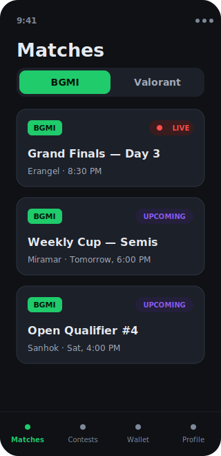
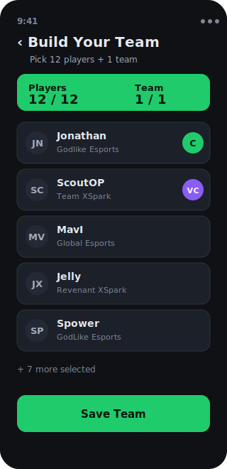
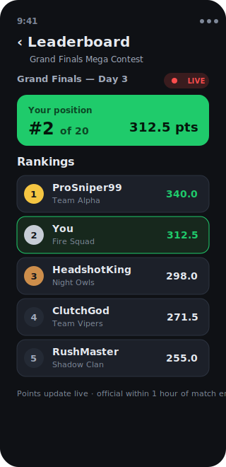

# 🎮 E-Fantasy

> A cross-platform, free-to-play **fantasy esports** app for **BGMI** — draft a roster of pro players, pick a Captain & Vice-Captain, join contests, and climb live leaderboards. **100% virtual currency — no real money, no payments, no gambling.**

<p align="center">
  
  
  
  
  
  
</p>

E-Fantasy is a full-stack mobile app built with **Expo / React Native** on the front end and **Supabase (PostgreSQL)** on the back end. Every piece of game and economy logic — roster validation, contest entry, prize payouts, refunds, and fantasy scoring — runs **server-side inside secured Postgres functions**, protected by **Row-Level Security**, so the client can never tamper with balances or results.

---

## 📸 Screenshots

| Matches | Team Builder | Live Leaderboard |
| :-----: | :----------: | :--------------: |
|  |  |  |

<sub>Design previews of the live app (dark theme shown — a light theme ships too). To showcase real device captures, replace the files in [`docs/screenshots/`](docs/screenshots/) with your own PNGs (see that folder's README).</sub>

---

## ✨ Features

### Player experience
- **Email + password auth** with a session guard that routes users in/out of the app automatically.
- **Virtual wallet** — every new player receives **1,000 E-Tokens** on sign-up, with a full transaction history (entry fees, winnings, refunds).
- **Match hub** with live status pills (Upcoming · **LIVE** · Completed) and a game toggle (BGMI live, Valorant "coming soon").
- **"My Contests"** and **tournament leaderboards** with your best-team summary and live rank.

### Fantasy gameplay
- **Team builder** — pick **12 players + 1 esports team**, then assign a **Captain (2×)** and **Vice-Captain (1.5×)**.
- **Multi-team & multi-entry** — build multiple rosters and enter the same contest with more than one team.
- **Contests** with configurable entry fees; the **prize pool is the sum of all entry fees**, paid out to winners when a match is finalized.
- Guardrails: you can't build teams for live/completed matches, and you can't join a contest after its match has started.

### Admin console (hidden, role-gated)
- **Tap-to-score dashboard** — quickly log kills / knocks / self-knocks per player; fantasy points recompute instantly.
- **Finish & Pay Winners** — one action finalizes a match and atomically distributes the prize pool.
- **In-app content management** — create matches, players, teams, and contests without touching the database.
- **Set matches live**, and **delete a tournament with full entry-fee refunds**.
- Optional **cron job** auto-deletes matches 5 days after completion.

### Design system — "Turf v1.0"
- Hand-built **dual light / dark theming engine** (`useTheme()` + per-palette `makeStyles`), with a **System / Light / Dark** toggle persisted across launches.
- **Manrope** typography applied app-wide, plus **Reanimated 4** micro-animations: button press feedback, a pulsing LIVE dot, staggered list entrances, and animated leaderboard rank changes.

---

## 🛠️ Tech Stack

| Layer | Technology |
| --- | --- |
| **Language** | TypeScript |
| **Mobile framework** | Expo (SDK 54) · React Native 0.81 · React 19 |
| **Navigation** | Expo Router (file-based) |
| **Animation** | React Native Reanimated 4 + Worklets |
| **Typography** | Manrope (`@expo-google-fonts`) |
| **Backend** | Supabase — PostgreSQL, Auth, Row-Level Security |
| **Business logic** | PL/pgSQL `SECURITY DEFINER` functions (RPCs) |
| **State/Storage** | React Context · AsyncStorage |
| **Targets** | iOS · Android · Web |

---

## 🧱 Architecture Highlights

**Secure-by-design backend.** Application tables have **no direct INSERT/UPDATE policies** — instead, all mutations flow through **13 `SECURITY DEFINER` PL/pgSQL functions** (e.g. `join_tournament`, `save_roster`, `finalize_match`, `admin_delete_tournament`) guarded by **27 Row-Level Security policies**. The client calls typed RPCs; the database enforces the rules. A user physically cannot mint tokens, alter someone else's roster, or read another player's private wallet.

**Atomic virtual economy.** Wallet debits (entry fees), credits (prize payouts), and refunds run inside single database transactions, so balances can never drift or double-pay — even under concurrent contest joins.

**Deterministic fantasy scoring.** Points are derived from a configurable `scoring_rules` table and computed entirely in SQL, applying Captain/Vice-Captain multipliers before ranking.

**A theming engine that solves a real RN constraint.** Because RN 0.81 + React 19 render `Text` as a plain function component (so the classic `Text.render` font override silently no-ops), the global Manrope default is applied by **wrapping the JSX runtime** (`jsx` / `jsxs` / `jsxDEV`) to inject the correct weight-mapped font family — while short-circuiting on explicit `fontFamily` so icon glyphs stay intact.

---

## 🎯 How Scoring Works

Each player's base points come from their in-game stats:

| Event | Points |
| --- | --- |
| Kill | **+5** |
| Knock (down) | **+5** |
| Self-knock | **−5** |

A roster's total is the sum of its players' base points, with role multipliers applied:

```
roster points = Σ ( player_base_points × role_multiplier )

role_multiplier =  2.0×  if Captain
                   1.5×  if Vice-Captain
                   1.0×  otherwise
```

All values live in the `scoring_rules` table and can be tuned without a code change.

---

## 📁 Project Structure

```
E-fantasy-app/
├── app/                      # Screens (Expo Router, file-based routing)
│   ├── _layout.tsx           #   Root: fonts, theming, auth session guard
│   ├── (auth)/               #   Login / Register
│   ├── (tabs)/               #   Matches · My Contests · Wallet · Profile
│   ├── match/[id].tsx        #   Match details + contests
│   ├── tournament/[id].tsx   #   Contest details + Join
│   ├── team/[matchId].tsx    #   Team builder (12 players + 1 team, C/VC)
│   ├── leaderboard/[id].tsx  #   Live ranked leaderboard
│   └── admin/                #   Role-gated scoring & content management
├── components/               # Reusable UI (cards, buttons, animations)
├── constants/theme.tsx       # Dual-theme engine + design tokens
├── lib/                      # Supabase client, auth context, fonts, formatters
├── supabase/                 # Backend as ordered SQL migrations
│   ├── 01_schema.sql         #   Tables, RLS, 1,000-token signup bonus
│   ├── 02_functions.sql      #   Game + admin logic (scoring, join, payout…)
│   ├── 03_seed.sql           #   Sample data + admin bootstrap
│   └── 04_cleanup_cron.sql   #   Optional auto-cleanup job
└── docs/design-systems/      # Design-system research & the "Turf v1.0" spec
```

---

## 🚀 Getting Started

### Prerequisites
- [Node.js](https://nodejs.org/) (LTS)
- The **Expo Go** app on your phone (must match the project's SDK — currently **SDK 54**)
- A free [Supabase](https://supabase.com/) project

### 1. Clone & install
```bash
git clone https://github.com/itz-puneet/e-fantasy-app.git
cd e-fantasy-app
npm install
```

### 2. Configure environment
Create a `.env` file in the project root (it is gitignored — never commit real keys):
```env
EXPO_PUBLIC_SUPABASE_URL=https://YOUR-PROJECT.supabase.co
EXPO_PUBLIC_SUPABASE_ANON_KEY=YOUR-ANON-KEY
```
> Use the **base** project URL (no `/rest/v1/` suffix). Both values are in your Supabase dashboard → **Project Settings → API**.

### 3. Set up the database
In the Supabase dashboard → **SQL Editor**, run the files in `supabase/` **in order**:
```
01_schema.sql  →  02_functions.sql  →  03_seed.sql  →  04_cleanup_cron.sql (optional)
```
Then, in **Authentication → Providers → Email**, disable **"Confirm email"** so sign-up logs users in immediately. To grant yourself admin, set your email in `03_seed.sql` before running it (or update `profiles.is_admin` afterwards).

### 4. Run
```bash
npx expo start --clear
```
Scan the QR code with **Expo Go**, or press `w` to open the web build.

---

## 🗺️ Status & Roadmap

- ✅ Auth, wallet, matches, team builder, contests, live leaderboards
- ✅ Admin scoring dashboard, payouts, refunds, in-app content management
- ✅ "Turf v1.0" dual-theme design system + Manrope typography + Reanimated motion
- 🔜 Valorant support · push notifications · real-time leaderboard subscriptions

---

## ⚖️ Disclaimer

E-Fantasy is a **free-to-play game for entertainment only**. All "E-Tokens" are **virtual**, have **no cash value**, and cannot be purchased, redeemed, or exchanged. There is **no gambling** and **no real-money transaction** of any kind.

---

## 👤 Author

Built by [**@itz-puneet**](https://github.com/itz-puneet).
Repository: [github.com/itz-puneet/e-fantasy-app](https://github.com/itz-puneet/e-fantasy-app)
